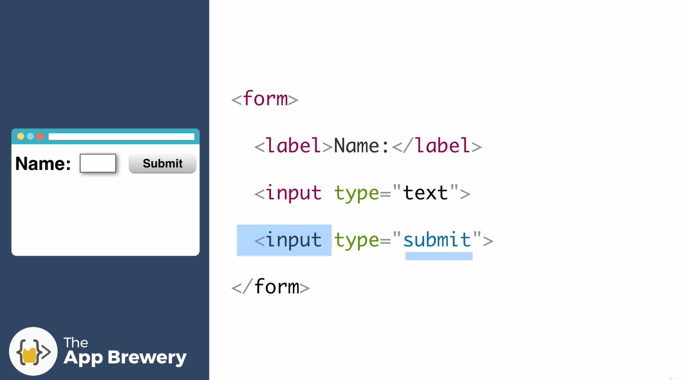
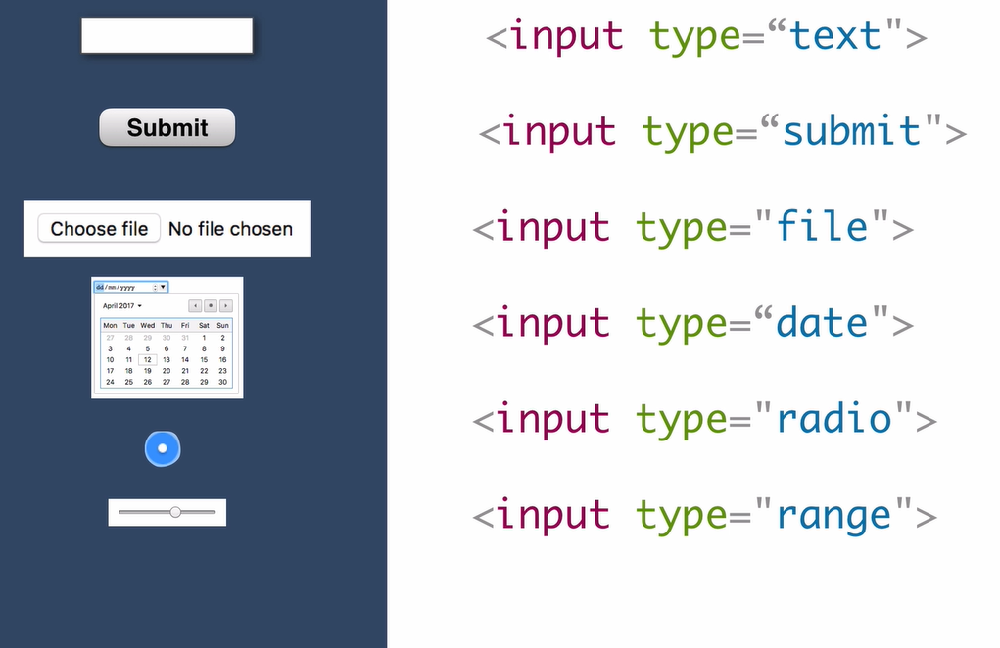
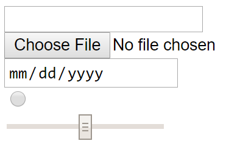

# Forms

```HTML
<form class="" action="index.html" method="post">
      <label>Your Name</label>
      <input type="text" name="" value="">
      <input type="color" name="" value=""><br>
      <label>Do you want to sign up to the email list?</label>
      <input type="checkbox" name="" value="">
      <input type="submit" name="">
    </form>
```


- We use the form tag to define what should go into our form
- In order for the form to do anything, you need: label and input
- The input is a self-closing tag; defined by type attribute - predefined keywords



- Aside from text types, we have an array of other types for input as well:




# Inputs

```HTML
<!DOCTYPE html>
<html lang="en" dir="ltr">

<head>
  <meta charset="utf-8">
  <title></title>
</head>

<body>
  <form>
    <input type="text" name="" value=""><br>
    <input type="file" name="" value=""><br>
    <input type="date" name="" value=""><br>
    <input type="radio" name="" value=""><br>
    <input type="range" name="" value=""><br>
  </form>
</body>

</html>
```


# Putting it all together

Finally, our contact page and the HTML form looks like:

```HTML
<!DOCTYPE html>
<html lang="en" dir="ltr">
  <head>
    <meta charset="utf-8">
    <title>Contact Me</title>
  </head>
  <body>
    <h1>My Contact Details</h1>
    <p>My Fictional Address</p>
    <p>My Fictional Email</p>
    <p>myemail@gmail.com</p>

    <form action="mailto:aaronasherrandall@gmail.com" method="post" enctype="text/plain">
      <label>Your Name</label>
      <input type="text" name="yourName" value=""><br>
      <label>Your Email:</input>
      <input type="email" name="yourEmail" value=""><br>
      <label>Your Message:</label>
      <textarea name="yourMessage" rows="10" cols="30"></textarea><br>
      <input type="submit" name="">
    </form>
  </body>
</html>
```

- We set our encoding type to "plain/text" to tell the data in our form how to encoded

- We also set the form action to ```mailto``` - this relies on email clients to send the form data from the customer's computer to the form owner. The form data that is completed by the website user is emailed to a specific address as specified in the coding for the form:
```HTML
    <form action="mailto:aaronasherrandall@gmail.com" method="post" enctype="text/plain">
```

- We can add a value to each of the name attributes - this will identify the data that is inside each of the following inputs
```HTML
      <input type="text" name="yourName" value=""><br>
      <label>Your Email:</input>
```

- The data is then populated in the email for the client as such:
```
yourName=aaron
yourEmail=aaron@gmail.com
yourMessage=hello
```

- Also, the email input type performs basic form validation for us in HTML:
```HTML
      <input type="email" name="yourEmail" value=""><br>
```
