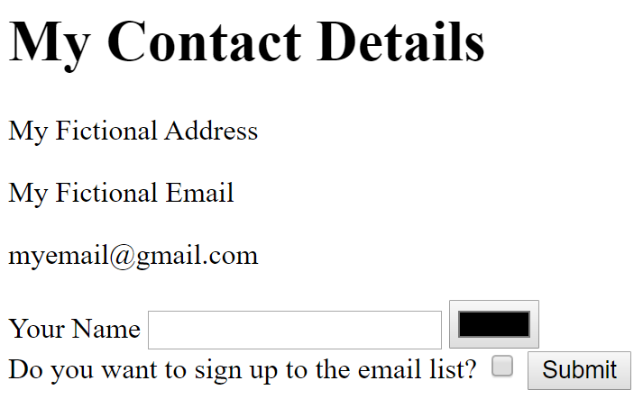

# Forms

```HTML
<form class="" action="index.html" method="post">
      <label>Your Name</label>
      <input type="text" name="" value="">
      <input type="color" name="" value=""><br>
      <label>Do you want to sign up to the email list?</label>
      <input type="checkbox" name="" value="">
      <input type="submit" name="">
    </form>
```

