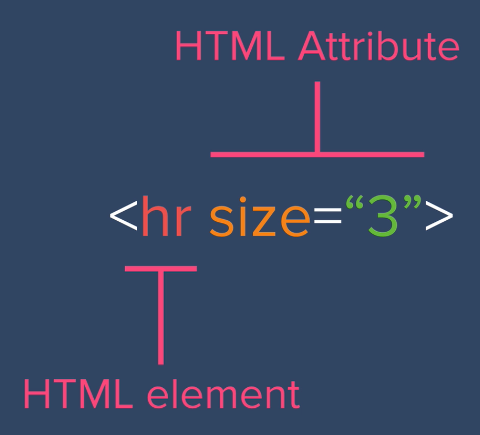

# web_dev

# Introduction to HTML

Anatomy of HTML

**HTML element which requires a start and end tag:**
```HTML
<h1>Hello World</h1>
```
- Start tag
- Content
- End Tag

**HTML elements which have a self-closing tage; they do not require a closing tag:
```HTML
<br>
<hr>
```

**Attributes**

- HTML Element: br, hr; an individual component of an HTML document or web page
- HTML Attribute: gives more information to the browser to specify modifications to the HTML element



- The Attribute comes after the Element and is separated by a single space.

Use https://devdocs.io/ to check on attributes for each HTML element.
