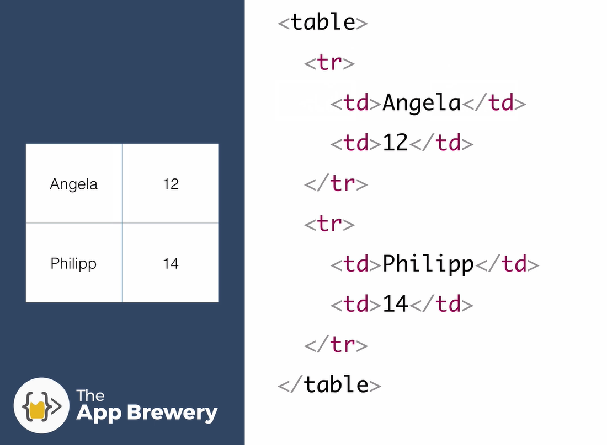

# Tables in HTML
```HTML
<body>
<table>
    <thead>
      <tr>
        <th>Dates</th>
        <th>Work</th>
      </tr>
    </thead>
</body>    
```
- ```<thead>``` will automatically title the verticle columns in our table

```HTML
 <body> 
  <table>
    <tr>
      <td>2015-2018</td>
      <td>Director of Sales at Tokyo Apartment</td>
    </tr>
    <tr>
      <td>2018</td>
      <td>Marketing & PR at Bang & Olufsen</td>
    </tr>
    <td>2019</td>
    <td>Digital Marketing Manager at Abcam</td>
  </table>
</body>
```
- ```<tr>``` **table rows** and ```<td>``` **table data** can be used to populate our tables
- ```<tr>``` only creates a single row inside our table with no associative styling
- ```<td>``` is where we place the data that will go inside our cell


- all attributes in table element are deprecated - or "downgraded" https://developer.mozilla.org/en-US/docs/Web/HTML/Element/table
- HTML is for structure, CSS is for styling and JavaScript is for behavior
- Even though it's possible to affect the style of your website using HTML, it is best practice to do this with CSS - i.e., why the attributes are deprecated for tables

### There are no table columns
- We just go from top to bottom - defining new table **rows**



# Nested Tables

```HTML
<h3>Skills</h3>
  <table>
    <tr>
      <td>
        <table>
          <tr>
            <td>Japanese Language</td>
            <td>⭐⭐⭐⭐⭐</td>
          </tr>
          <tr>
            <td>Digital Marketing</td>
            <td>⭐⭐⭐⭐</td>
          </tr>
        </table>
      </td>
      <td>
        <table>
          <tr>
            <td>Programming</td>
            <td>⭐⭐⭐</td>
          </tr>
          <tr>
            <td>Machine Learning</td>
            <td>⭐⭐</td>
          </tr>
        </table>
      </td>
    </tr>
  </table>
```


