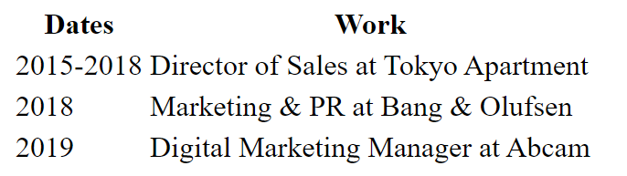

# Tables in HTML
```HTML
<body>
<table>
    <thead>
      <tr>
        <th>Dates</th>
        <th>Work</th>
      </tr>
    </thead>
</body>    
```
- ```<thead>``` will automatically title the verticle columns in our table

```HTML
 <body> 
  <table>
    <tr>
      <td>2015-2018</td>
      <td>Director of Sales at Tokyo Apartment</td>
    </tr>
    <tr>
      <td>2018</td>
      <td>Marketing & PR at Bang & Olufsen</td>
    </tr>
    <td>2019</td>
    <td>Digital Marketing Manager at Abcam</td>
  </table>
</body>
```
- ```<tr>``` **table rows** and ```<td>``` **table data** can be used to populate our tables



